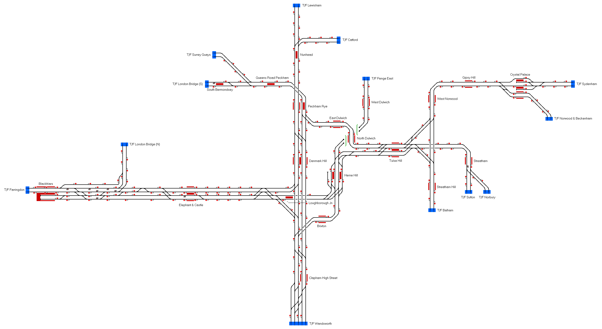

# South London and Thameslink
A route covering many of the commuter lines in South London, including the Thameslink route as far as Blackfriars.

## Current Status

| Stage         | Status        |
| ------------- |:-------------:|
| Track Plan     |  |
| Signalling      |       |
| Naming |       |
| Speed Limits |  |
| Distances |  |
| Timetable |  |
| Documentation |  |

## Data Sources

- [TRAKSY.UK](https://traksy.uk/live/M+23+DONC/M+18+WDULWCH/M+9+LBGHJN+11)
- [OpenStreetMap](https://www.openstreetmap.org/#map=14/51.4574/-0.0948)
- [Meurisse](https://map.meurisse.org/)
- [RealTime Trains](https://www.realtimetrains.co.uk/)

Status icons by Freepik, pixelmeetup, Pixel Perfect on FlatIcon.com.
